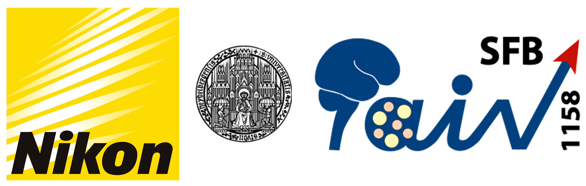

  

# Trends in Microscopy 2023 Workshop

## **<u>WS 17</u>: How Machine Learning and Deep Learning Tools help Image Acquisition and Analysis Workflows Design? Hands-on Session: Exploring and Combining Open Source and Commercial Software Solutions**

Machine learning and deep learning, or more generally, artificial intelligence (AI) methods, are becoming a powerful resource for scientists to better understand biological processes in living or fixed specimen. The aim of the workshop is to cover common AI tools and let participants understand when and how these methods can be used giving real example cases. We provide an overview on commercial software solutions focusing on Nikon.ai and arivis tools for machine learning and deep learning. Further, we cover open source tools for image segmentation such as ilastik pixel classification methods, StarDist and CellPose neural networks. During the workshop, the participants will explore how AI tools work and how they can be potentially combined with traditional image analysis methods to properly quantify scientific images. 

Image segmentation is the base for image quantification, however image denoising and restoration can resolve spatial and temporal resolution limits that otherwise cannot be overcome due to e.g. sample viability/phototoxicity, photobleaching and sample noise. Indeed, during the workshop, we aim to cover deep learning image restoration and image denoising methods, such as Nikon denoise.ai, enhance.ai and the open source noise2voide (N2V) deep learning tool. To facilitate the understanding and show the flexibility of these methods, we will provide images acquired with different microscopy modalities before the workshop and during the event at a Nikon AX R confocal microscope. 
The overall goal is to let participants learn when AI tools can be applied and combined to build a bioimage analysis workflow. Moreover, we would like to share the sufficient knowledge and allow scientists with limited expertise in computer science to train and apply their own deep learning model to answer scientific questions.

## Workshop Organizers:

Dr Carlo Antonio Beretta (BioImage Analyst @ Heidelberg University) carlo.beretta@uni-heidelberg.de 

Dr Thomas Schubert (Application Specialist @ Nikon Germany) Thomas.schubert@nikon.com 

## Prepared Workshop Material:

[Done] `cellpose.exe` Windows with GPU

[Done] Stardist conda env for Jupyter Notebook (Windows with GPU and MacM1)

[Done] Stardist Jupyter Notebook for 3D training and prediction

[Done] ImageJ/Fiji startdist plugin for prediction

[Done] Build Napari N2V exe file with `pyinstaller`

[Done] pyinstaller with `NucleusAI.exe`for Windows with GPU support

[Done] Download and configure installers for Fiji, download ilastik installer, anaconda or miniconda installer and git

[Done] BAND, bwVisu

[Done] Speed up GT annotation LabKit and ilastik pixel classification

[Done] Data examples

[Done] CARE general idea (no demo, focus on Nikon enhance.ai)

## Workshop Schedule:

<u>When:</u> 

- Monday, 20th of March - 08:30 PM to 11:30 PM
- Wednesday, 22nd of March - 08:30 PM to 11:30 PM
- Thursday, 23th of March - 03:30 PM to 07:00 PM

<u>Where:</u> 

Albgut Altes Lager, Hauptstraße 318 Münsingen, 72525 Deutschland, <u>Seminar room **Sch3**</u>

XXX <u>Location and time might change</u> XXX

## Workshop Outlook:

- Introduction to machine learning and deep learning (AI)
- Denoise images with *Nikon* *Denoise.ai* and *Napari* *Noise2Void*
- Image restoration with *Nikon* *Enhance.ai* and *CARE*
- Generate ground truth images (Labkit ImageJ/Fiji)
- Ilastik pixel classification to speed up ground truth annotations
- Segment convex object with Nikon *Segment.ai* and *stardist* 
- *Nikon Convert.ai*

## Key-Links:

[Anaconda](https://www.anaconda.com/), [Miniconda](https://docs.conda.io/en/latest/miniconda.html)

[Jupyter Notebook](https://jupyter.org/), [Stardist](https://github.com/stardist), [N2V](https://github.com/juglab/napari-n2v), [CellPose](https://github.com/MouseLand/cellpose), [Napari](https://napari.org/stable/), [ilastik](https://www.ilastik.org/), [ImageJ/Fiji](ImageJ/Fiji), [LabKit](https://imagej.net/plugins/labkit/)

[Nikon NIS-Elements](https://www.microscope.healthcare.nikon.com/it_EU/products/software/nis-elements), [Nikon NIS-Elements AI Tools](https://www.microscope.healthcare.nikon.com/products/software/nis-elements/nis-ai-1)

[TensorFlow](https://www.tensorflow.org/), [cuda-toolkit](https://developer.nvidia.com/cuda-toolkit), [cuDNN](https://developer.nvidia.com/cudnn)

[bwVisu](https://www.bwvisu.de/), [BAND](https://band.embl.de/#/eosc-landingpage)

## References:

Schmidt, U., Weigert, M., Broaddus, C., & Myers, G.  (2018). Cell Detection with Star-Convex Polygons. In Medical Image  Computing and Computer Assisted Intervention – MICCAI 2018 (pp.  265–273). Springer International Publishing.[ doi:10.1007/978-3-030-00934-2_30](https://doi.org/10.1007/978-3-030-00934-2_30)

Krull, A., et al. (2018) Noise2Void - Learning Denoising from Single Noisy Images. arXiv:1811.10980

Stringer, C., et al. (2021). "Cellpose: a generalist algorithm for cellular segmentation." Nature Methods **18**(1): 100-106.

Weigert, M., et al. (2018). "Content-aware image restoration: pushing the limits of fluorescence microscopy." Nat Methods **15**(12): 1090-1097.

Schindelin, J., Arganda-Carreras, I., Frise, E., Kaynig, V., Longair, M., Pietzsch, T., … Cardona, A. (2012). Fiji: an open-source platform for  biological-image analysis. *Nature Methods*, *9*(7), 676–682.[ doi:10.1038/nmeth.2019](https://doi.org/10.1038/nmeth.2019)

napari contributors (2019). napari: a multi-dimensional image viewer for python. [doi:10.5281/zenodo.3555620](https://zenodo.org/record/3555620)

*ilastik: interactive machine learning for (bio)image analysis* Stuart Berg, Dominik Kutra, Thorben Kroeger, Christoph N. Straehle,  Bernhard X. Kausler, Carsten Haubold, Martin Schiegg, Janez Ales,  Thorsten Beier, Markus Rudy, Kemal Eren, Jaime I Cervantes, Buote Xu,  Fynn Beuttenmueller, Adrian Wolny, Chong Zhang, Ullrich Koethe, Fred A.  Hamprecht & Anna Kreshuk in: Nature Methods, (2019)

Arzt, M., Deschamps, J., Schmied, C., Pietzsch, T., Schmidt, D., Tomancak,  P., … Jug, F. (2022). LABKIT: Labeling and Segmentation Toolkit for Big  Image Data. *Frontiers in Computer Science*, *4*.[ doi:10.3389/fcomp.2022.777728](https://doi.org/10.3389/fcomp.2022.777728)

Ouyang, W., et al. (2022). "BioImage Model Zoo: A Community-Driven Resource for Accessible Deep Learning in BioImage Analysis." bioRxiv: 2022.2006.2007.495102.
