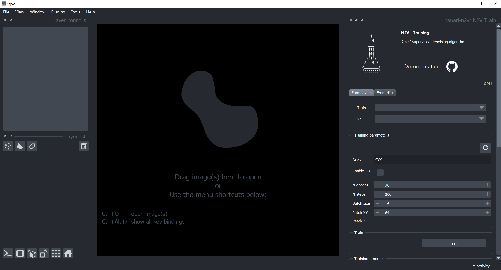

# Napari-n2v Installation in conda for Windows 10

Source: https://juglab.github.io/napari-n2v/installation.html

1. Download [miniconda](https://docs.conda.io/en/latest/miniconda.html) or [anconda](https://www.anaconda.com/)

2.  Open the conda terminal and create the `napari-n2v` environment

   ```bash
   conda create -n napari-n2v python=3.9
   ```

3. Activate the napari-n2v environment

   ```bash
   conda activate napari-n2v
   ```

 4. Install GPU support with TensorFlow **(Nvidia drivers need to be installed or updated to the latest version)**

    ```bash
    conda install -c conda-forge tensorflow=2.9.1=gpu_py39hb21c0df_0
    ```

5. Install `napari` by pip

   ```bash
   pip install "napari[all]==0.4.15"
   ```

6. Install napari-n2v

   ```bash
   pip install napari-n2v
   ```

7. Run napari from your conda environment (it will take few second to start)

   ```bash
   napari
   ```

# Quick and dirty: Build Napari-n2v with pyinstaller

Source: https://github.com/tlambert03/napari-pyinstaller

This is not a very easy task but I think could be a good starting point if someone wants to play with `napari` and `pyinstaller`.

`.spec file`

```python
# -*- mode: python ; coding: utf-8 -*-
import sys
from PyInstaller.building.build_main import Analysis, PYZ, EXE, COLLECT, BUNDLE
from PyInstaller.utils.hooks import collect_submodules

import napari
import vispy.glsl
import vispy.io

sys.modules["FixTk"] = None


NAME = "napari-app"
WINDOWED = True
DEBUG = False
UPX = False
BLOCK_CIPHER = None

data_files = [
    (os.path.dirname(vispy.glsl.__file__), os.path.join("vispy", "glsl")),
    (os.path.join(os.path.dirname(vispy.io.__file__), "_data"), os.path.join("vispy", "io", "_data")),
]


hidden_imports = [
    "vispy.ext._bundled.six",
    "vispy.app.backends._pyqt5",
    "napari",
    "napari_n2v._train_widget",
    "npe2",
    "napari._event_loop",
    "napari.view_layers",
    "mypy_extensions",
    "fa33d3e2c63a4523d3c5__mypyc",
    "matplotlib",
    "chardet",
    "charset_normalizer.md__mypyc",
    "cycler",
]

def get_icon():
    logo_file = "logo.ico" if sys.platform.startswith("win") else "logo.icns"
    return logo_file


def get_version():
    if sys.platform != "win32":
        return None

    from PyInstaller.utils.win32 import versioninfo as vi

    ver_str = napari.__version__
    version = ver_str.replace("+", ".").split(".")
    version = [int(x) for x in version if x.isnumeric()]
    version += [0] * (4 - len(version))
    version = tuple(version)[:4]
    return vi.VSVersionInfo(
        ffi=vi.FixedFileInfo(filevers=version, prodvers=version),
        kids=[
            vi.StringFileInfo(
                [
                    vi.StringTable(
                        "000004b0",
                        [
                            vi.StringStruct("CompanyName", NAME),
                            vi.StringStruct("FileDescription", NAME),
                            vi.StringStruct("FileVersion", ver_str),
                            vi.StringStruct("LegalCopyright", ""),
                            vi.StringStruct("OriginalFileName", NAME + ".exe"),
                            vi.StringStruct("ProductName", NAME),
                            vi.StringStruct("ProductVersion", ver_str),
                        ],
                    )
                ]
            ),
            vi.VarFileInfo([vi.VarStruct("Translation", [0, 1200])]),
        ],
    )


a = Analysis(
    ["main.py"],
    hookspath=["hooks"],
    excludes=[
        "FixTk",
        "tcl",
        "tk",
        "_tkinter",
        "tkinter",
        "Tkinter",
        "matplotlib",
    ],
    datas=data_files,
    hiddenimports=hidden_imports,
    cipher=BLOCK_CIPHER,
)

pyz = PYZ(a.pure, a.zipped_data, cipher=BLOCK_CIPHER)

exe = EXE(
    pyz,
    a.scripts,
    [],
    exclude_binaries=True,
    name=NAME,
    debug=DEBUG,
    upx=UPX,
    console=(not WINDOWED),
    icon=get_icon(),
    version=get_version(),
)

coll = COLLECT(
    exe,
    a.binaries,
    a.zipfiles,
    a.datas,
    upx=UPX,
    name=NAME,
)

if sys.platform == "darwin":
    app = BUNDLE(
        coll,
        name=NAME + ".app",
        icon=get_icon(),
        bundle_identifier=f"com.{NAME}.{NAME}",
        info_plist={
            "CFBundleIdentifier": f"com.{NAME}.{NAME}",
            "CFBundleShortVersionString": napari.__version__,
            "NSHighResolutionCapable": "True",
        },
    )
```


## Build napari-n2v:

1. Install `napari-n2v` as described above

2. Clone the napari-pyinstaller repository

   ```bash
   git clone https://github.com/tlambert03/napari-pyinstaller.git
   ```

3. Build napari-n2v with pyinstaller

   ```bash
   pyinstaller `NAME_YOUR_SPEC_FILE.spec --noconfirm --clean`
   ```

4. Copy the following folder from your conda environment in the dist >> napari-app main directory

    

5. Copy the cuda `dll` file from your local cuda installation

6. Double click on the napari-n2v.exe file    

   <p align="center">
     
   </p>

