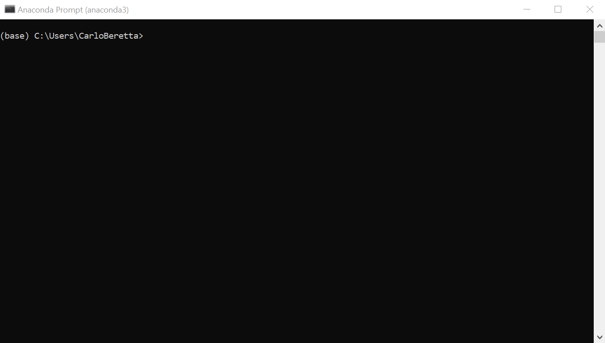
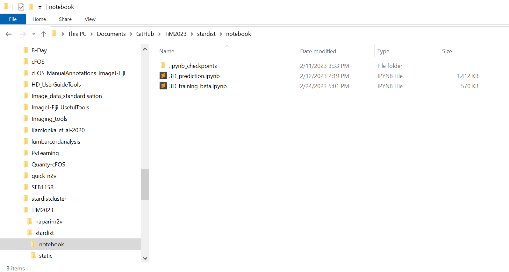
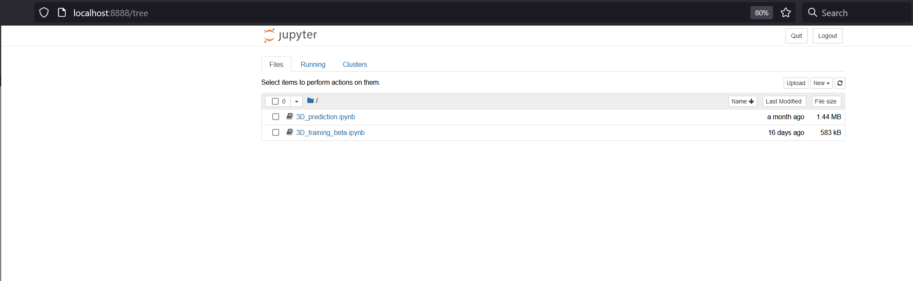
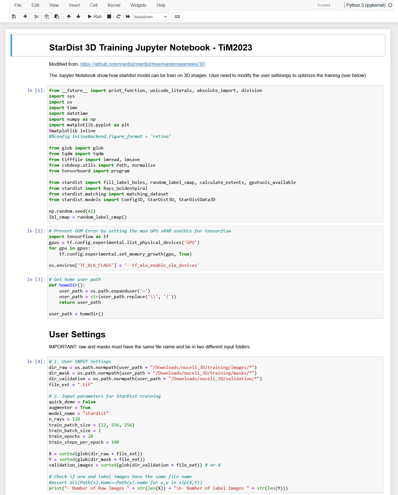

# Stardist Jupyter Notebook conda installation for Windows 10 with GPU

1. Download [miniconda](https://docs.conda.io/en/latest/miniconda.html) or [anconda](https://www.anaconda.com/) [ANACONDA IS ALREADY INSTALLED ON YOUR SYSTEM >> SKIP THIS STEP]

2. Open the `Anaconda Prompt Window`     

   <p align="center">
     
   </p>

3. Navigate to the `Documents` folder and clone the git repository `TiM2023`

   ```bash
   cd Documents
   git clone https://github.com/cberri/TiM2023.git
   ```

4. Create the conda environment using the `environment_Windows10.yml` file. To open .yml file you can use `Sublime Text`

   `cd TiM2023\stardist\Windows10\env`

   `conda env create -f enviroment_Windows10.yml`

   ```yaml
   # THIS IS THE YML FILE INSTRUCTIONS TO CREATE THE CONDA ENVIROMENT FOR WINDOWS 10
   # To manually install the yml run: conda env create -f enviroment_Windows10.yml
   # To remove the conda env: conda remove --name TiM23_stardist --all
   name: TiM23_stardist
   channels:
       - conda-forge
   dependencies:
       - python=3.9
       - cudatoolkit=11.3.1
       - cudnn=8.2
       - tensorflow=2.9.1=gpu_py39hb21c0df_0
       - scikit-image
       - jupyter
       - csbdeep=0.7.2
       - gputools=0.2.13
       - stardist=0.8.3
   ```

5. After the env is set, activate the stardist environment (env name: **TiM23_stardist**)

   `conda activate Tim23_stardist`

6. Navigate to the `notebooks` folder 

   ```bash
   cd ..
   cd ..
   cd notebook
   ```

   <p align="center">
     
   </p>

7. Start the jupyter notebook by typing in the `Anaconda Prompt Window`

   `jupyter notebook`

   <p align="center">
     
   </p>

8. Click on `3D_training_beta.ipynb` notebook for training or on `3D_prediction.ipynb` for running the inference 

   <p align="center">
     
   </p>


## OPTIONAL:

1. Install the ipykernel package

   `conda install ipykernel`

2. Register your virtual environment as custom kernel to Jupyter

   `python3 -m ipykernel install --user --name=<myKernel>`